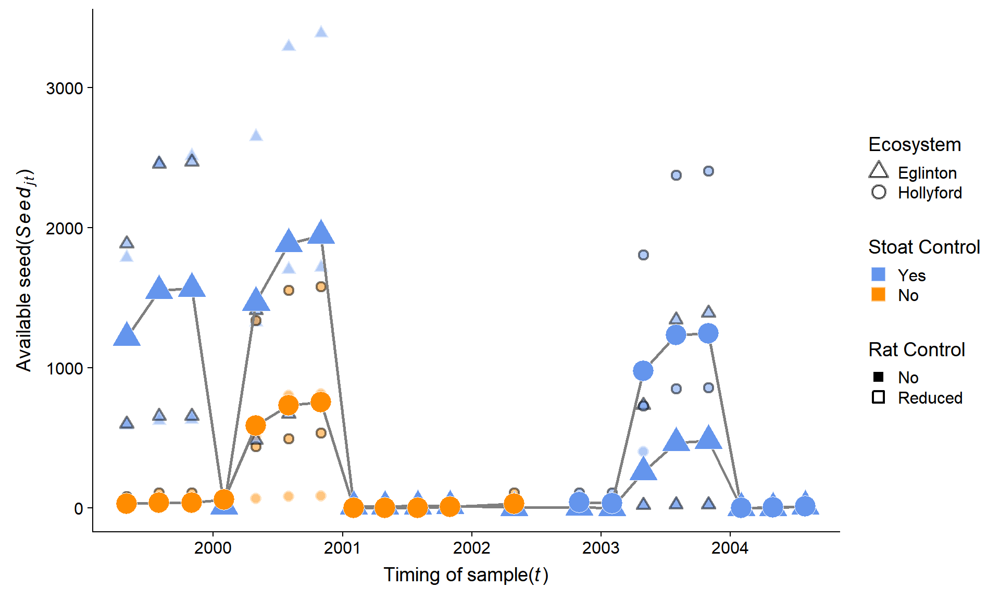
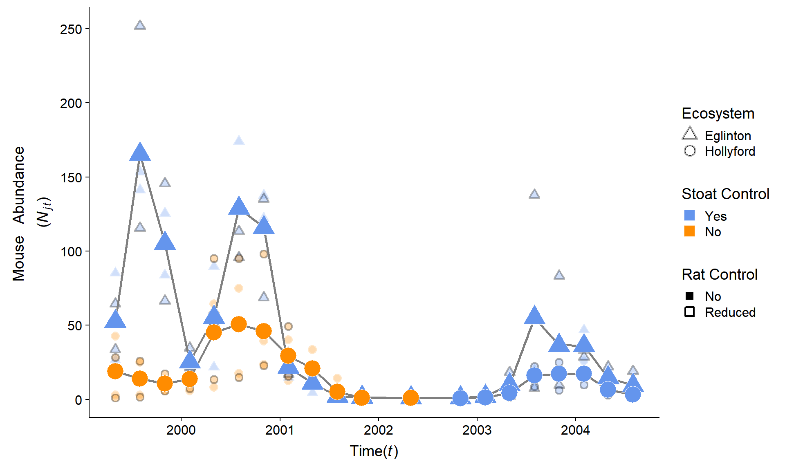

# Overview

New Zealand beech forests exhibit boom-bust dynamics (Figure 1). Where,
beech trees mast in spatial synchronised but annually variable years
dependant (Wardle 1991). Mice populations have invaded these systems and
studies have shown that populations response numerically to changes in
resources (beech seed) and mice have been modelled under a range of both
functional and numerical responses (King 1983).

This report investigates the estimation of the raw observations. The
data is in a similar structure as historically used for estimation of
food availability (Choquenot and Ruscoe 2000; Ruscoe, Goldsmith, and
Choquenot 2001; Ruscoe et al. 2005).

# Introduction and Methods

*Generally look at thesis drafts [here](%22https://www.ssnhub.com/%22).*

This RMarkdown file is intend to be extended on for different species of
trees, fruit and seed. These files are the supporting documetation to
the data-wrangling code in the Beech forest manuscript
[here](%22https://www.ssnhub.com/invasive-species-research.html/%22).

Bbut there is also many other supporting resources and less formal
tutorials on my [website](https://www.ssnhub.com) and the feed below:

## Invasive species notes

## Tidyverse

To aviod issues with factors and data management I have used the
following pre-print publications authored by the creators of `dplyr` and
`ggplot2`. Tidyverse is a group of packages that together make use a
`tidy` approach effective.

Here is some more information about the [tidyverse
approach](%22https://www.ssnhub.com/a-tidy-world.html%22)

## Meta-data

  - [Current
    draft](https://www.dropbox.com/home/phd-drafts-anthony/beech-forest-dynamics/drafts/Davidson_2019_BeechForest.html)

  - [Style
    sheet](https://www.dropbox.com/home/phd-drafts-anthony/beech-forest-dynamics/Styles_manual_sheet.md/)

  - [Introduction](https://www.dropbox.com/sh/5h4mp67p7u6t1lj/AAAQVKS4qnvu2oQLu53JQUofa?dl=0)

  - [Bayesian
    methods](https://www.dropbox.com/home/phd-drafts-anthony/beech-forest-dynamics/A1_full_bayesian_model.pdf)

  - [Figures](https://www.dropbox.com/home/phd-drafts-anthony/beech-forest-dynamics/figs)

  - [Functional
    response](https://www.dropbox.com/home/phd-drafts-anthony/beech-forest-dynamics/Davidson_2019_BeechForest_Appendix.pdf)

  - [References](): *coming online soon*

All other data and resources to render project from raw data (copied
from my private GIT repository) can be found on
[dropbox](https://www.dropbox.com/home/phd-drafts-anthony) but will be
available here when I have incorporated the co-authors feedback


<a href="{{ post.url }}">{{ post.title }}</a> ({{ post.date |
date\_to\_string }})<br> {{ post.description }} 

## Variable structure

I have defined the following parameters that help to keep the type of
variable the same throughout the joining of the raw data and the model
outputs.

### Group levels

THis has been hard to do with as little manual mistakes in factor levels
as possible. The levelling structure should be the same throughout this
document as descripted in beech data above.

*But in short*

#### Labels/levels

*all mixed up* **still**

``` r
#month levels to get it right
month_levels <- c("Jan", "Feb", "Mar", "Apr", "May", "Jun","Jul", "Aug", "Sep", "Oct", "Nov", "Dec")

# full set of dates
true.date <- as.Date(c("1999-05-01","1999-08-01","1999-11-01","2000-02-01","2000-05-01","2000-08-01","2000-11-01","2001-02-01","2001-05-01","2001-08-01", "2001-11-01","2002-05-01","2002-11-01","2003-02-01","2003-05-01","2003-08-01","2003-11-01","2004-02-01","2004-05-01","2004-08-01"))

# Grid labels
labels <- c("egl M1" = "Grid one", 
            "egl M2" = "Grid two", 
            "egl MR1" = "Grid three",
            "egl MR2" = "Grid four",
            "hol M1" = "Grid five",
            "hol M2" = "Grid six",
            "hol MR1" = "Grid seven",
            "hol MR2" = "Grid eight")

# Valley labels
labels2 <- c(egl = "Eglinton valley", hol = "Hollyford valley")
```

##### Full treatment

**6 levels**

``` r
treat.six.levels <- c("hol no control rats.removed",
                                     "hol control rats.present",
                                     "hol control rats.removed",
                                     "egl control rats.present",
                                     "egl control rats.removed" ,
                                     "hol no control rats.present")
```

In this the structure of the variables for the seed dataset have to be
joint and visualised we need to insure that there are the same number of
replicates in this dataset as the output dataset (from the JAGS model).

##### Still coming out of wash

COntrol labels - Stoats yes/no

Conditions labals - Rats yes/no

### Seasonal factorisation

In the data the seasonal parameter is month where:

| Month    | Season | Factor level |
| -------- | ------ | ------------ |
| February | Summer | 1            |
| May      | Autumn | 2            |
| August   | Winter | 3            |
| November | Spring | 4            |

# Seeds

This is important because the following bias are known and need to be
accounted for before analysising data.

1.  Seeds without the kernal have no energy value and need to be
    removed.

2.  Different beech species produce different sized seeds and this has
    an effect on the “available seed”.

3.  As our models build in complexity we will include a variety of food
    resources and therefore need to model these relationships in the
    future

## Importing data

The orginal data was in excel format and manually covered to csv as
below. This has had the non-viable material removed and only whole
kernals of seed for three species of beech tree were reported.

### Seed Measurement

The data is very clean with all the information but to make life
simplier for the analysis and bindng to output data to be correct.

#### Method - `metre sq (m2)`

1.  `Bucket radius = 0.125m`

2.  `Bucket area = 0.049087385m2`

3.  `4 buckets per grid = total catch area = 0.19635 m2`

4.  `So seeds /m2 =# Seeds counted/0.1963`

Therefore, if \(800\) seeds were counted on a grid on a particular trip,
this will equate to \(4000 m^2\).

### Find extra trips and grids

### Remove additional data

## Final seed dataset

This is the full raw data reduction for the publication and in all the
analysis. This data is lagged by a single trip (as a proxy for seed to
“intake rate” relationship). Descriptive plots can be found in
appendix.

    # A tibble: 144 x 13
    # Groups:   grid, year [44]
       valley   red silver seedm2 grid.id grid  trip.no  year month total
       <chr>  <dbl>  <dbl>  <dbl> <chr>   <chr>   <dbl> <dbl> <fct> <dbl>
     1 egl       81     31  591.  M1      egl ~       1  1999 May     116
     2 egl        5      1   30.6 M1      egl ~       2  1999 Aug       6
     3 egl        1      0   10.2 M1      egl ~       3  1999 Nov       2
     4 egl        0      0   20.4 M1      egl ~       4  2000 Feb       4
     5 egl      222     31 1304.  M1      egl ~       5  2000 May     256
     6 egl       48     26  377.  M1      egl ~       6  2000 Aug      74
     7 egl        1      2   15.3 M1      egl ~       7  2000 Nov       3
     8 egl        0      0    0   M1      egl ~       8  2001 Feb       0
     9 egl        0      0    0   M1      egl ~       9  2001 May       0
    10 egl        0      0    0   M1      egl ~      10  2001 Aug       0
    # ... with 134 more rows, and 3 more variables: cum.seed <dbl>,
    #   trip <dbl>, log.cum.seed <dbl>

# Mice

The mouse dataset is generated from the full CR model found
[here](%22https://www.ssnhub.com/jags-bayesian-model.html%22)

## Import data

The seed data above needs to be joined to the mouse dataset below. I
will step through this process to insure that there are no errors in the
merging of the two datasets.

### JAGS output

The output data of the model is in JAGS format. This means that it needs
to be converted into a `dataframe` format. There are many different ways
to do this. I have choosen the following tidy approach.

We save and sort the bayesian model outputs in a `.rds` file and extract
these results using:

*JAGSui output* (Kellner 2018).

#### Naming variable

#### Extract only N

## Restructuring dataset

### Adding grouping variables

### Reduced seed joining dataset

Check the structure of this to make sure that the variables being joined
are being correctly merged.

    # A tibble: 144 x 6
    # Groups:   grid, year [44]
       grid    trip  year month cum.seed valley
       <chr>  <dbl> <dbl> <fct>    <dbl> <chr> 
     1 egl M1     1  1999 May      591.  egl   
     2 egl M1     2  1999 Aug      621.  egl   
     3 egl M1     3  1999 Nov      632.  egl   
     4 egl M1     4  2000 Feb       20.4 egl   
     5 egl M1     5  2000 May     1324.  egl   
     6 egl M1     6  2000 Aug     1701.  egl   
     7 egl M1     7  2000 Nov     1716.  egl   
     8 egl M1     8  2001 Feb        0   egl   
     9 egl M1     9  2001 May        0   egl   
    10 egl M1    10  2001 Aug        0   egl   
    # ... with 134 more rows

### Joining seed and mice

# Stoat control

**control variable**

# Rat removal

**treatment variable**

# More grouping options

# Re-leveling dataset

Just a final check that everything has worked.

# Saved datasets

I will save the final dataset for the analysis of the Beech foret data
for the publication as so: The final plots. All extended plots are in
the `Rcode/figures/`. These plots focus on simplifying the general
trends and confirming any previous predictions.

## Study design

CR-design is complex and when treatments and conditions change through
time it can be very hard to explain the data collection methods well. We
have therefore constructed a diagram of the study design process.

### Data

``` 
              N       se.N lcl.N ucl.N     var grid trip grid.n trip.no
1    85.1859200 17.2583357    53   114  N[1,1]    1    1      1       1
2   141.3464533 24.8136961   103   200  N[2,1]    1    2      1       2
3   125.5429067 15.7174287   100   162  N[3,1]    1    3      1       3
4    23.7692733  1.6613580    22    28  N[4,1]    1    4      1       4
5    89.5302533 18.5405013    57   125  N[5,1]    1    5      1       5
6   132.5741133 24.5620601    88   179  N[6,1]    1    6      1       6
7   122.0759400 18.1190611    93   164  N[7,1]    1    7      1       7
8    31.7279867  4.5500564    25    43  N[8,1]    1    8      1       8
9    17.7766000  3.4972180    13    26  N[9,1]    1    9      1       9
10    1.7254933  1.4848549     0     5 N[10,1]    1   10      1      10
11    1.8865333  1.0505487     1     5 N[11,1]    1   11      1      11
12    2.0739600  1.1312553     1     5 N[12,1]    1   12      1      12
13    1.8775800  1.0535847     1     5 N[13,1]    1   13      1      13
14    2.8021800  1.3119014     1     5 N[14,1]    1   14      1      14
15    9.1295667  2.7541247     6    16 N[15,1]    1   15      1      15
16   19.7637467  4.4373185    14    31 N[16,1]    1   16      1      16
17   16.4246267  3.3984265    12    25 N[17,1]    1   17      1      17
18   46.9253733  5.8563486    38    61 N[18,1]    1   18      1      18
19   12.7332733  1.7571200    11    17 N[19,1]    1   19      1      19
20    5.0774133  1.4166088     4     9 N[20,1]    1   20      1      20
21    3.0208733  1.3450687     1     5  N[1,5]    5    1      5       1
22    2.8780333  1.2995776     1     5  N[2,5]    5    2      5       2
23    5.7663800  1.0765730     5     9  N[3,5]    5    3      5       3
24    5.8326667  1.8577646     4    11  N[4,5]    5    4      5       4
25    8.0432933  2.0951551     6    13  N[5,5]    5    5      5       5
26   17.4978400  5.2770757    10    31  N[6,5]    5    6      5       6
27   23.4858000  2.0762403    21    29  N[7,5]    5    7      5       7
28   12.5922333  2.3266218    10    18  N[8,5]    5    8      5       8
29   12.5659133  2.3354796    10    18  N[9,5]    5    9      5       9
30    3.6653667  1.5555888     2     7 N[10,5]    5   10      5      10
31    0.5788733  0.9042259     0     3 N[11,5]    5   11      5      11
32    0.4286200  0.7919443     0     3 N[12,5]    5   12      5      12
33   26.7002733  6.9963955    14    39  N[1,2]    2    1      2       1
34  153.4814600 22.5388578   106   187  N[2,2]    2    2      2       2
35   83.8898000 12.2935592    65   113  N[3,2]    2    3      2       3
36   20.6275933  5.6231922    13    35  N[4,2]    2    4      2       4
37   21.8430867  4.4692861    12    28  N[5,2]    2    5      2       5
38  174.0751667 28.0430338   119   221  N[6,2]    2    6      2       6
39  137.7298933 24.7730792    98   195  N[7,2]    2    7      2       7
40   14.8999067  3.7884997    10    25  N[8,2]    2    8      2       8
41    4.3853733  1.5835816     3     9  N[9,2]    2    9      2       9
42    1.4344200  1.4076005     0     5 N[10,2]    2   10      2      10
43    1.2519333  1.3262006     0     5 N[11,2]    2   11      2      11
44    0.5977067  0.9450323     0     3 N[12,2]    2   12      2      12
45   42.6130600 11.4645750    26    71  N[1,6]    6    1      6       1
46   25.1329800  6.5160616    16    41  N[2,6]    6    2      6       2
47   13.6169000  2.3001209    11    19  N[3,6]    6    3      6       3
48   16.8606067  4.3836633     9    24  N[4,6]    6    4      6       4
49   64.4446000 15.0336258    41   100  N[5,6]    6    5      6       5
50   75.0234800 10.7600722    59   100  N[6,6]    6    6      6       6
51   39.2508533  5.3909009    31    52  N[7,6]    6    7      6       7
52   40.3002800  4.8891681    33    52  N[8,6]    6    8      6       8
53   33.5121067  4.7634320    27    45  N[9,6]    6    9      6       9
54   14.3737467  1.4818034    13    18 N[10,6]    6   10      6      10
55    1.7581333  1.4974007     0     5 N[11,6]    6   11      6      11
56    1.1710733  1.2836478     0     4 N[12,6]    6   12      6      12
57    0.7280600  1.0114192     0     3 N[13,6]    6   13      6      13
58    1.8226867  1.0255537     1     5 N[14,6]    6   14      6      14
59    6.1585000  2.1184289     4    12 N[15,6]    6   15      6      15
60   17.6586733  5.1176164    11    31 N[16,6]    6   16      6      16
61   20.3918133  3.7869994    15    30 N[17,6]    6   17      6      17
62   25.9511867  2.7999053    22    33 N[18,6]    6   18      6      18
63    9.5354533  0.8656027     9    12 N[19,6]    6   19      6      19
64    3.7418533  1.1596534     3     7 N[20,6]    6   20      6      20
65   33.6136533  9.3001387    19    54  N[1,3]    3    1      3       1
66  115.6386333 22.1384099    82   169  N[2,3]    3    2      3       2
67   66.4721267 11.0983640    50    93  N[3,3]    3    3      3       3
68   21.7572267  6.2016791    13    38  N[4,3]    3    4      3       4
69   59.6559200 14.3702540    37    91  N[5,3]    3    5      3       5
70   95.6277933 18.1413784    61   126  N[6,3]    3    6      3       6
71  135.1908467 17.2233365   107   174  N[7,3]    3    7      3       7
72   17.1843133  3.7747561    12    27  N[8,3]    3    8      3       8
73   12.3089467  2.8509378     9    20  N[9,3]    3    9      3       9
74    3.2570733  1.4036190     2     7 N[10,3]    3   10      3      10
75    1.1439333  1.2554523     0     4 N[11,3]    3   11      3      11
76    0.7696933  1.0401824     0     4 N[12,3]    3   12      3      12
77    0.5596733  0.8801615     0     3 N[13,3]    3   13      3      13
78    0.9671600  1.1778331     0     4 N[14,3]    3   14      3      14
79    2.2531333  1.2115775     1     5 N[15,3]    3   15      3      15
80    7.5758267  1.7176156     6    12 N[16,3]    3   16      3      16
81    9.6676600  3.3945633     5    18 N[17,3]    3   17      3      17
82   28.6356800  3.5865801    24    37 N[18,3]    3   18      3      18
83    9.0626200  2.7092313     6    16 N[19,3]    3   19      3      19
84    4.1717000  1.4689929     3     8 N[20,3]    3   20      3      20
85    1.1363867  1.3230711     0     5  N[1,7]    7    1      7       1
86    1.6561200  1.4600322     0     5  N[2,7]    7    2      7       2
87    5.7983333  1.1131122     5     9  N[3,7]    7    3      7       3
88    7.3883533  2.6577250     4    14  N[4,7]    7    4      7       4
89   13.3638533  4.3440001     7    24  N[5,7]    7    5      7       5
90   14.7074533  4.8699228     8    26  N[6,7]    7    6      7       6
91   22.9210000  4.0279243    18    33  N[7,7]    7    7      7       7
92   15.5500933  4.0432478    10    26  N[8,7]    7    8      7       8
93   15.9540067  3.1086560    12    24  N[9,7]    7    9      7       9
94    1.2033133  1.3067626     0     5 N[10,7]    7   10      7      10
95    0.4812667  0.8066887     0     3 N[11,7]    7   11      7      11
96    1.5046467  0.8118104     1     4 N[12,7]    7   12      7      12
97    0.4138533  0.7468127     0     2 N[13,7]    7   13      7      13
98    1.7238000  0.9751922     1     4 N[14,7]    7   14      7      14
99    4.9565400  1.9479485     3    10 N[15,7]    7   15      7      15
100   8.6274733  3.0680265     5    17 N[16,7]    7   16      7      16
101   6.3765333  2.3553668     4    13 N[17,7]    7   17      7      17
102   9.8058000  3.2223504     6    18 N[18,7]    7   18      7      18
103   2.9605467  1.2640098     2     6 N[19,7]    7   19      7      19
104   2.3225667  1.2551525     1     5 N[20,7]    7   20      7      20
105  64.6098800 10.8058545    41    80  N[1,4]    4    1      4       1
106 251.7874933 37.8692209   180   321  N[2,4]    4    2      4       2
107 145.6319600 13.0921003   124   175  N[3,4]    4    3      4       3
108  34.7808933  3.5161202    30    43  N[4,4]    4    4      4       4
109  50.8623467 10.4808274    35    76  N[5,4]    4    5      4       5
110 113.3821800 18.2013719    85   155  N[6,4]    4    6      4       6
111  68.5532733 11.3131370    51    95  N[7,4]    4    7      4       7
112  23.1075267  3.5111717    18    32  N[8,4]    4    8      4       8
113   9.6502533  2.4592352     7    16  N[9,4]    4    9      4       9
114   2.4061333  1.2540174     1     5 N[10,4]    4   10      4      10
115   1.2331400  1.3036808     0     5 N[11,4]    4   11      4      11
116   0.8539867  1.0884950     0     4 N[12,4]    4   12      4      12
117   0.6612267  0.9591170     0     3 N[13,4]    4   13      4      13
118   2.4902333  1.2681780     1     5 N[14,4]    4   14      4      14
119  18.2583133  5.5507086    10    32 N[15,4]    4   15      4      15
120 137.9636067 26.6359789    92   194 N[16,4]    4   16      4      16
121  83.2831467 10.6074033    67   108 N[17,4]    4   17      4      17
122  33.2969667  2.8805473    29    40 N[18,4]    4   18      4      18
123  22.0818600  2.3836520    19    28 N[19,4]    4   19      4      19
124  19.0726867  3.7056913    14    28 N[20,4]    4   20      4      20
125  28.4410200  8.0499404    16    46  N[1,8]    8    1      8       1
126  25.7660733  5.2063307    18    38  N[2,8]    8    2      8       2
127  17.2867467  3.1319219    13    25  N[3,8]    8    3      8       3
128  24.6842467  7.0968718    14    41  N[4,8]    8    4      8       4
129  95.1692200 17.3285899    68   135  N[5,8]    8    5      8       5
130  95.0518000 10.5532494    78   119  N[6,8]    8    6      8       6
131  98.0393533 10.5587134    81   122  N[7,8]    8    7      8       7
132  49.2863800  9.1742521    36    71  N[8,8]    8    8      8       8
133  20.9976267  2.3945033    18    27  N[9,8]    8    9      8       9
134   1.4411533  1.4126631     0     5 N[10,8]    8   10      8      10
135   0.6817800  0.9730651     0     3 N[11,8]    8   11      8      11
136   0.8670200  1.1146291     0     4 N[12,8]    8   12      8      12
137   0.7162933  1.0086017     0     3 N[13,8]    8   13      8      13
138   0.5281533  0.8603327     0     3 N[14,8]    8   14      8      14
139   1.5135667  1.4491572     0     5 N[15,8]    8   15      8      15
140  22.3608800  4.8747011    16    34 N[16,8]    8   16      8      16
141  25.0682000  3.3892101    20    33 N[17,8]    8   17      8      17
142  15.7021800  4.6506531    10    28 N[18,8]    8   18      8      18
143   6.7500800  2.4113521     4    13 N[19,8]    8   19      8      19
144   3.9404867  1.2937630     3     7 N[20,8]    8   20      8      20
    valley    control    Valley year month    cum.seed seed.account.N
1      egl    control  Eglinton 1999   May  590.781767      6.9352044
2      egl    control  Eglinton 1999   Aug  621.339445      4.3958616
3      egl    control  Eglinton 1999   Nov  631.525337      5.0303546
4      egl    control  Eglinton 2000   Feb   20.371785      0.8570639
5      egl    control  Eglinton 2000   May 1324.166030     14.7901517
6      egl    control  Eglinton 2000   Aug 1701.044054     12.8308914
7      egl    control  Eglinton 2000   Nov 1716.322893     14.0594690
8      egl    control  Eglinton 2001   Feb    0.000000      0.0000000
9      egl    control  Eglinton 2001   May    0.000000      0.0000000
10     egl    control  Eglinton 2001   Aug    0.000000      0.0000000
11     egl    control  Eglinton 2001   Nov    0.000000      0.0000000
12     egl    control  Eglinton 2002   May    5.092946      2.4556627
13     egl    control  Eglinton 2002   Nov    5.092946      2.7125056
14     egl    control  Eglinton 2003   Feb    0.000000      0.0000000
15     egl    control  Eglinton 2003   May   20.371785      2.2314077
16     egl    control  Eglinton 2003   Aug   25.464731      1.2884567
17     egl    control  Eglinton 2003   Nov   25.464731      1.5503994
18     egl    control  Eglinton 2004   Feb    0.000000      0.0000000
19     egl    control  Eglinton 2004   May    0.000000      0.0000000
20     egl    control  Eglinton 2004   Aug    0.000000      0.0000000
21     hol no control Hollyford 1999   May    0.000000      0.0000000
22     hol no control Hollyford 1999   Aug    0.000000      0.0000000
23     hol no control Hollyford 1999   Nov    0.000000      0.0000000
24     hol no control Hollyford 2000   Feb    0.000000      0.0000000
25     hol no control Hollyford 2000   May   66.208302      8.2314916
26     hol no control Hollyford 2000   Aug   81.487140      4.6569828
27     hol no control Hollyford 2000   Nov   86.580087      3.6864866
28     hol no control Hollyford 2001   Feb    0.000000      0.0000000
29     hol no control Hollyford 2001   May    0.000000      0.0000000
30     hol no control Hollyford 2001   Aug    0.000000      0.0000000
31     hol no control Hollyford 2001   Nov    0.000000      0.0000000
32     hol no control Hollyford 2002   May    0.000000      0.0000000
33     egl    control  Eglinton 1999   May 1787.624141     66.9515296
34     egl    control  Eglinton 1999   Aug 2464.985994     16.0604805
35     egl    control  Eglinton 1999   Nov 2510.822511     29.9300095
36     egl    control  Eglinton 2000   Feb    0.000000      0.0000000
37     egl    control  Eglinton 2000   May 2648.332060    121.2434900
38     egl    control  Eglinton 2000   Aug 3290.043290     18.9001301
39     egl    control  Eglinton 2000   Nov 3386.809269     24.5902265
40     egl    control  Eglinton 2001   Feb   30.557678      2.0508637
41     egl    control  Eglinton 2001   May   30.557678      6.9680904
42     egl    control  Eglinton 2001   Aug   40.743570     28.4042123
43     egl    control  Eglinton 2001   Nov   40.743570     32.5445206
44     egl    control  Eglinton 2002   May    0.000000      0.0000000
45     hol no control Hollyford 1999   May   25.464731      0.5975804
46     hol no control Hollyford 1999   Aug   30.557678      1.2158398
47     hol no control Hollyford 1999   Nov   30.557678      2.2440994
48     hol no control Hollyford 2000   Feb   81.487140      4.8329898
49     hol no control Hollyford 2000   May  514.387573      7.9818569
50     hol no control Hollyford 2000   Aug  804.685511     10.7257823
51     hol no control Hollyford 2000   Nov  814.871403     20.7606035
52     hol no control Hollyford 2001   Feb    0.000000      0.0000000
53     hol no control Hollyford 2001   May    0.000000      0.0000000
54     hol no control Hollyford 2001   Aug    0.000000      0.0000000
55     hol no control Hollyford 2001   Nov    5.092946      2.8967918
56     hol no control Hollyford 2002   May    0.000000      0.0000000
57     hol    control Hollyford 2002   Nov    0.000000      0.0000000
58     hol    control Hollyford 2003   Feb    0.000000      0.0000000
59     hol    control Hollyford 2003   May  402.342755     65.3312909
60     hol    control Hollyford 2003   Aug  473.644003     26.8221737
61     hol    control Hollyford 2003   Nov  473.644003     23.2271645
62     hol    control Hollyford 2004   Feb    0.000000      0.0000000
63     hol    control Hollyford 2004   May    0.000000      0.0000000
64     hol    control Hollyford 2004   Aug   25.464731      6.8053793
65     egl    control  Eglinton 1999   May  600.967660     17.8786773
66     egl    control  Eglinton 1999   Aug  656.990069      5.6814064
67     egl    control  Eglinton 1999   Nov  656.990069      9.8836926
68     egl    control  Eglinton 2000   Feb   25.464731      1.1704034
69     egl    control  Eglinton 2000   May 1410.746117     23.6480490
70     egl    control  Eglinton 2000   Aug 1874.204227     19.5989488
71     egl    control  Eglinton 2000   Nov 1930.226636     14.2777909
72     egl    control  Eglinton 2001   Feb   10.185893      0.5927436
73     egl    control  Eglinton 2001   May   10.185893      0.8275194
74     egl    control  Eglinton 2001   Aug   10.185893      3.1273145
75     egl    control  Eglinton 2001   Nov   15.278839     13.3564067
76     egl    control  Eglinton 2002   May    5.092946      6.6168512
77     egl    control  Eglinton 2002   Nov    5.092946      9.0998552
78     egl    control  Eglinton 2003   Feb    0.000000      0.0000000
79     egl    control  Eglinton 2003   May   20.371785      9.0415355
80     egl    control  Eglinton 2003   Aug   25.464731      3.3613139
81     egl    control  Eglinton 2003   Nov   25.464731      2.6340119
82     egl    control  Eglinton 2004   Feb    0.000000      0.0000000
83     egl    control  Eglinton 2004   May    0.000000      0.0000000
84     egl    control  Eglinton 2004   Aug    0.000000      0.0000000
85     hol no control Hollyford 1999   May   81.487140     71.7072302
86     hol no control Hollyford 1999   Aug  106.951872     64.5797839
87     hol no control Hollyford 1999   Nov  106.951872     18.4452782
88     hol no control Hollyford 2000   Feb   61.115355      8.2718506
89     hol no control Hollyford 2000   May  437.993379     32.7744826
90     hol no control Hollyford 2000   Aug  494.015788     33.5894853
91     hol no control Hollyford 2000   Nov  534.759358     23.3305422
92     hol no control Hollyford 2001   Feb    0.000000      0.0000000
93     hol no control Hollyford 2001   May    0.000000      0.0000000
94     hol no control Hollyford 2001   Aug    0.000000      0.0000000
95     hol no control Hollyford 2001   Nov    0.000000      0.0000000
96     hol no control Hollyford 2002   May   20.371785     13.5392485
97     hol    control Hollyford 2002   Nov   20.371785     49.2246490
98     hol    control Hollyford 2003   Feb  106.951872     62.0442462
99     hol    control Hollyford 2003   May 1807.995926    364.7697639
100    hol    control Hollyford 2003   Aug 2373.312962    275.0878351
101    hol    control Hollyford 2003   Nov 2403.870639    376.9870733
102    hol    control Hollyford 2004   Feb    0.000000      0.0000000
103    hol    control Hollyford 2004   May   10.185893      3.4405445
104    hol    control Hollyford 2004   Aug   10.185893      4.3856190
105    egl    control  Eglinton 1999   May 1884.390120     29.1656651
106    egl    control  Eglinton 1999   Aug 2454.800102      9.7494918
107    egl    control  Eglinton 1999   Nov 2470.078941     16.9611048
108    egl    control  Eglinton 2000   Feb    5.092946      0.1464294
109    egl    control  Eglinton 2000   May  483.829896      9.5125358
110    egl    control  Eglinton 2000   Aug  672.268908      5.9292290
111    egl    control  Eglinton 2000   Nov  748.663102     10.9208950
112    egl    control  Eglinton 2001   Feb    5.092946      0.2204021
113    egl    control  Eglinton 2001   May    5.092946      0.5277526
114    egl    control  Eglinton 2001   Aug    5.092946      2.1166517
115    egl    control  Eglinton 2001   Nov    5.092946      4.1300633
116    egl    control  Eglinton 2002   May    0.000000      0.0000000
117    egl    control  Eglinton 2002   Nov    0.000000      0.0000000
118    egl    control  Eglinton 2003   Feb    0.000000      0.0000000
119    egl    control  Eglinton 2003   May  733.384263     40.1671419
120    egl    control  Eglinton 2003   Aug 1344.537815      9.7455978
121    egl    control  Eglinton 2003   Nov 1390.374332     16.6945461
122    egl    control  Eglinton 2004   Feb    0.000000      0.0000000
123    egl    control  Eglinton 2004   May    0.000000      0.0000000
124    egl    control  Eglinton 2004   Aug   40.743570      2.1362261
125    hol no control Hollyford 1999   May   10.185893      0.3581409
126    hol no control Hollyford 1999   Aug   10.185893      0.3953219
127    hol no control Hollyford 1999   Nov   10.185893      0.5892313
128    hol no control Hollyford 2000   Feb   91.673033      3.7138274
129    hol no control Hollyford 2000   May 1339.444869     14.0743496
130    hol no control Hollyford 2000   Aug 1553.348612     16.3421273
131    hol no control Hollyford 2000   Nov 1578.813344     16.1038735
132    hol no control Hollyford 2001   Feb    0.000000      0.0000000
133    hol no control Hollyford 2001   May    0.000000      0.0000000
134    hol no control Hollyford 2001   Aug    5.092946      3.5339378
135    hol no control Hollyford 2001   Nov   25.464731     37.3503643
136    hol no control Hollyford 2002   May  106.951872    123.3557146
137    hol    control Hollyford 2002   Nov  106.951872    149.3129514
138    hol    control Hollyford 2003   Feb    0.000000      0.0000000
139    hol    control Hollyford 2003   May  728.291317    481.1755786
140    hol    control Hollyford 2003   Aug  850.522027     38.0361608
141    hol    control Hollyford 2003   Nov  860.707920     34.3346519
142    hol    control Hollyford 2004   Feb    0.000000      0.0000000
143    hol    control Hollyford 2004   May    0.000000      0.0000000
144    hol    control Hollyford 2004   Aug    0.000000      0.0000000
     log.seed valley.rep grid.rats   Conditions  grouping.1  grouping.2
1   2.7714271        egl        M1 rats.removed treat.highN treat.highN
2   2.7933289        egl        M1 rats.removed treat.highN treat.highN
3   2.8003908        egl        M1 rats.removed treat.highN treat.highN
4   1.3090291        egl        M1 rats.removed  treat.lowN treat.highN
5   3.1219424        egl        M1 rats.removed treat.highN treat.highN
6   3.2307156        egl        M1 rats.removed treat.highN treat.highN
7   3.2345990        egl        M1 rats.removed treat.highN treat.highN
8   0.0000000        egl        M1 rats.removed  treat.lowN treat.highN
9   0.0000000        egl        M1 rats.removed  treat.lowN treat.highN
10  0.0000000        egl        M1 rats.removed  treat.lowN  treat.lowN
11  0.0000000        egl        M1 rats.removed  treat.lowN  treat.lowN
12  0.7069691        egl        M1 rats.removed  treat.lowN  treat.lowN
13  0.7069691        egl        M1 rats.removed  treat.lowN  treat.lowN
14  0.0000000        egl        M1 rats.removed  treat.lowN  treat.lowN
15  1.3090291        egl        M1 rats.removed  treat.lowN  treat.lowN
16  1.4059391        egl        M1 rats.removed  treat.lowN treat.highN
17  1.4059391        egl        M1 rats.removed  treat.lowN treat.highN
18  0.0000000        egl        M1 rats.removed  treat.lowN treat.highN
19  0.0000000        egl        M1 rats.removed  treat.lowN treat.highN
20  0.0000000        egl        M1 rats.removed  treat.lowN  treat.lowN
21  0.0000000        hol        M1 rats.removed  treat.lowN  treat.lowN
22  0.0000000        hol        M1 rats.removed  treat.lowN  treat.lowN
23  0.0000000        hol        M1 rats.removed  treat.lowN  treat.lowN
24  0.0000000        hol        M1 rats.removed  treat.lowN  treat.lowN
25  1.8209124        hol        M1 rats.removed  treat.lowN  treat.lowN
26  1.9110891        hol        M1 rats.removed  treat.lowN treat.highN
27  1.9374180        hol        M1 rats.removed  treat.lowN treat.highN
28  0.0000000        hol        M1 rats.removed  treat.lowN treat.highN
29  0.0000000        hol        M1 rats.removed  treat.lowN treat.highN
30  0.0000000        hol        M1 rats.removed  treat.lowN  treat.lowN
31  0.0000000        hol        M1 rats.removed  treat.lowN  treat.lowN
32  0.0000000        hol        M1 rats.removed  treat.lowN  treat.lowN
33  3.2522762        egl        M2 rats.removed  treat.lowN treat.highN
34  3.3918145        egl        M2 rats.removed treat.highN treat.highN
35  3.3998160        egl        M2 rats.removed treat.highN treat.highN
36  0.0000000        egl        M2 rats.removed  treat.lowN treat.highN
37  3.4229724        egl        M2 rats.removed  treat.lowN treat.highN
38  3.5172016        egl        M2 rats.removed treat.highN treat.highN
39  3.5297907        egl        M2 rats.removed treat.highN treat.highN
40  1.4851203        egl        M2 rats.removed  treat.lowN treat.highN
41  1.4851203        egl        M2 rats.removed  treat.lowN  treat.lowN
42  1.6100591        egl        M2 rats.removed  treat.lowN  treat.lowN
43  1.6100591        egl        M2 rats.removed  treat.lowN  treat.lowN
44  0.0000000        egl        M2 rats.removed  treat.lowN  treat.lowN
45  1.4059391        hol        M2 rats.removed  treat.lowN treat.highN
46  1.4851203        hol        M2 rats.removed  treat.lowN treat.highN
47  1.4851203        hol        M2 rats.removed  treat.lowN treat.highN
48  1.9110891        hol        M2 rats.removed  treat.lowN treat.highN
49  2.7112905        hol        M2 rats.removed treat.highN treat.highN
50  2.9056262        hol        M2 rats.removed treat.highN treat.highN
51  2.9110891        hol        M2 rats.removed  treat.lowN treat.highN
52  0.0000000        hol        M2 rats.removed  treat.lowN treat.highN
53  0.0000000        hol        M2 rats.removed  treat.lowN treat.highN
54  0.0000000        hol        M2 rats.removed  treat.lowN treat.highN
55  0.7069691        hol        M2 rats.removed  treat.lowN  treat.lowN
56  0.0000000        hol        M2 rats.removed  treat.lowN  treat.lowN
57  0.0000000        hol        M2 rats.removed  treat.lowN  treat.lowN
58  0.0000000        hol        M2 rats.removed  treat.lowN  treat.lowN
59  2.6045962        hol        M2 rats.removed  treat.lowN  treat.lowN
60  2.6754520        hol        M2 rats.removed  treat.lowN treat.highN
61  2.6754520        hol        M2 rats.removed  treat.lowN treat.highN
62  0.0000000        hol        M2 rats.removed  treat.lowN treat.highN
63  0.0000000        hol        M2 rats.removed  treat.lowN  treat.lowN
64  1.4059391        hol        M2 rats.removed  treat.lowN  treat.lowN
65  2.7788511        egl       MR1 rats.present  treat.lowN treat.highN
66  2.8175588        egl       MR1 rats.present treat.highN treat.highN
67  2.8175588        egl       MR1 rats.present treat.highN treat.highN
68  1.4059391        egl       MR1 rats.present  treat.lowN treat.highN
69  3.1494489        egl       MR1 rats.present treat.highN treat.highN
70  3.2728169        egl       MR1 rats.present treat.highN treat.highN
71  3.2856083        egl       MR1 rats.present treat.highN treat.highN
72  1.0079991        egl       MR1 rats.present  treat.lowN treat.highN
73  1.0079991        egl       MR1 rats.present  treat.lowN treat.highN
74  1.0079991        egl       MR1 rats.present  treat.lowN  treat.lowN
75  1.1840903        egl       MR1 rats.present  treat.lowN  treat.lowN
76  0.7069691        egl       MR1 rats.present  treat.lowN  treat.lowN
77  0.7069691        egl       MR1 rats.present  treat.lowN  treat.lowN
78  0.0000000        egl       MR1 rats.present  treat.lowN  treat.lowN
79  1.3090291        egl       MR1 rats.present  treat.lowN  treat.lowN
80  1.4059391        egl       MR1 rats.present  treat.lowN  treat.lowN
81  1.4059391        egl       MR1 rats.present  treat.lowN  treat.lowN
82  0.0000000        egl       MR1 rats.present  treat.lowN treat.highN
83  0.0000000        egl       MR1 rats.present  treat.lowN  treat.lowN
84  0.0000000        egl       MR1 rats.present  treat.lowN  treat.lowN
85  1.9110891        hol       MR1 rats.present  treat.lowN  treat.lowN
86  2.0291884        hol       MR1 rats.present  treat.lowN  treat.lowN
87  2.0291884        hol       MR1 rats.present  treat.lowN  treat.lowN
88  1.7861503        hol       MR1 rats.present  treat.lowN  treat.lowN
89  2.6414675        hol       MR1 rats.present  treat.lowN treat.highN
90  2.6937408        hol       MR1 rats.present  treat.lowN treat.highN
91  2.7281584        hol       MR1 rats.present  treat.lowN treat.highN
92  0.0000000        hol       MR1 rats.present  treat.lowN treat.highN
93  0.0000000        hol       MR1 rats.present  treat.lowN treat.highN
94  0.0000000        hol       MR1 rats.present  treat.lowN  treat.lowN
95  0.0000000        hol       MR1 rats.present  treat.lowN  treat.lowN
96  1.3090291        hol       MR1 rats.present  treat.lowN  treat.lowN
97  1.3090291        hol       MR1 rats.present  treat.lowN  treat.lowN
98  2.0291884        hol       MR1 rats.present  treat.lowN  treat.lowN
99  3.2571974        hol       MR1 rats.present  treat.lowN  treat.lowN
100 3.3753550        hol       MR1 rats.present  treat.lowN  treat.lowN
101 3.3809111        hol       MR1 rats.present  treat.lowN  treat.lowN
102 0.0000000        hol       MR1 rats.present  treat.lowN  treat.lowN
103 1.0079991        hol       MR1 rats.present  treat.lowN  treat.lowN
104 1.0079991        hol       MR1 rats.present  treat.lowN  treat.lowN
105 3.2751708        egl       MR2 rats.present treat.highN treat.highN
106 3.3900161        egl       MR2 rats.present treat.highN treat.highN
107 3.3927108        egl       MR2 rats.present treat.highN treat.highN
108 0.7069691        egl       MR2 rats.present  treat.lowN treat.highN
109 2.6846927        egl       MR2 rats.present treat.highN treat.highN
110 2.8275430        egl       MR2 rats.present treat.highN treat.highN
111 2.8742864        egl       MR2 rats.present treat.highN treat.highN
112 0.7069691        egl       MR2 rats.present  treat.lowN treat.highN
113 0.7069691        egl       MR2 rats.present  treat.lowN  treat.lowN
114 0.7069691        egl       MR2 rats.present  treat.lowN  treat.lowN
115 0.7069691        egl       MR2 rats.present  treat.lowN  treat.lowN
116 0.0000000        egl       MR2 rats.present  treat.lowN  treat.lowN
117 0.0000000        egl       MR2 rats.present  treat.lowN  treat.lowN
118 0.0000000        egl       MR2 rats.present  treat.lowN  treat.lowN
119 2.8653316        egl       MR2 rats.present  treat.lowN treat.highN
120 3.1285730        egl       MR2 rats.present treat.highN treat.highN
121 3.1431317        egl       MR2 rats.present treat.highN treat.highN
122 0.0000000        egl       MR2 rats.present  treat.lowN treat.highN
123 0.0000000        egl       MR2 rats.present  treat.lowN treat.highN
124 1.6100591        egl       MR2 rats.present  treat.lowN treat.highN
125 1.0079991        hol       MR2 rats.present  treat.lowN treat.highN
126 1.0079991        hol       MR2 rats.present  treat.lowN treat.highN
127 1.0079991        hol       MR2 rats.present  treat.lowN treat.highN
128 1.9622416        hol       MR2 rats.present  treat.lowN treat.highN
129 3.1269248        hol       MR2 rats.present treat.highN treat.highN
130 3.1912689        hol       MR2 rats.present treat.highN treat.highN
131 3.1983308        hol       MR2 rats.present treat.highN treat.highN
132 0.0000000        hol       MR2 rats.present treat.highN treat.highN
133 0.0000000        hol       MR2 rats.present  treat.lowN treat.highN
134 0.7069691        hol       MR2 rats.present  treat.lowN  treat.lowN
135 1.4059391        hol       MR2 rats.present  treat.lowN  treat.lowN
136 2.0291884        hol       MR2 rats.present  treat.lowN  treat.lowN
137 2.0291884        hol       MR2 rats.present  treat.lowN  treat.lowN
138 0.0000000        hol       MR2 rats.present  treat.lowN  treat.lowN
139 2.8623051        hol       MR2 rats.present  treat.lowN  treat.lowN
140 2.9296856        hol       MR2 rats.present  treat.lowN treat.highN
141 2.9348558        hol       MR2 rats.present  treat.lowN treat.highN
142 0.0000000        hol       MR2 rats.present  treat.lowN treat.highN
143 0.0000000        hol       MR2 rats.present  treat.lowN  treat.lowN
144 0.0000000        hol       MR2 rats.present  treat.lowN  treat.lowN
     grouping.3  grouping.4  true.date                   treat.six    Rats
1   treat.highN treat.highN 1999-05-01    egl control rats.removed Reduced
2   treat.highN treat.highN 1999-08-01    egl control rats.removed Reduced
3   treat.highN treat.highN 1999-11-01    egl control rats.removed Reduced
4   treat.highN treat.highN 2000-02-01    egl control rats.removed Reduced
5   treat.highN treat.highN 2000-05-01    egl control rats.removed Reduced
6   treat.highN treat.highN 2000-08-01    egl control rats.removed Reduced
7   treat.highN treat.highN 2000-11-01    egl control rats.removed Reduced
8    treat.lowN  treat.lowN 2001-02-01    egl control rats.removed Reduced
9    treat.lowN  treat.lowN 2001-05-01    egl control rats.removed Reduced
10   treat.lowN  treat.lowN 2001-08-01    egl control rats.removed Reduced
11   treat.lowN  treat.lowN 2001-11-01    egl control rats.removed Reduced
12   treat.lowN  treat.lowN 2002-05-01    egl control rats.removed Reduced
13   treat.lowN  treat.lowN 2002-11-01    egl control rats.removed Reduced
14  treat.highN treat.highN 2003-02-01    egl control rats.removed Reduced
15  treat.highN treat.highN 2003-05-01    egl control rats.removed Reduced
16  treat.highN treat.highN 2003-08-01    egl control rats.removed Reduced
17  treat.highN treat.highN 2003-11-01    egl control rats.removed Reduced
18   treat.lowN treat.highN 2004-02-01    egl control rats.removed Reduced
19   treat.lowN treat.highN 2004-05-01    egl control rats.removed Reduced
20   treat.lowN treat.highN 2004-08-01    egl control rats.removed Reduced
21  treat.highN treat.highN 1999-05-01 hol no control rats.removed Reduced
22  treat.highN treat.highN 1999-08-01 hol no control rats.removed Reduced
23  treat.highN treat.highN 1999-11-01 hol no control rats.removed Reduced
24  treat.highN treat.highN 2000-02-01 hol no control rats.removed Reduced
25  treat.highN treat.highN 2000-05-01 hol no control rats.removed Reduced
26  treat.highN treat.highN 2000-08-01 hol no control rats.removed Reduced
27  treat.highN treat.highN 2000-11-01 hol no control rats.removed Reduced
28   treat.lowN  treat.lowN 2001-02-01 hol no control rats.removed Reduced
29   treat.lowN  treat.lowN 2001-05-01 hol no control rats.removed Reduced
30   treat.lowN  treat.lowN 2001-08-01 hol no control rats.removed Reduced
31   treat.lowN  treat.lowN 2001-11-01 hol no control rats.removed Reduced
32   treat.lowN  treat.lowN 2002-05-01 hol no control rats.removed Reduced
33  treat.highN treat.highN 1999-05-01    egl control rats.removed Reduced
34  treat.highN treat.highN 1999-08-01    egl control rats.removed Reduced
35  treat.highN treat.highN 1999-11-01    egl control rats.removed Reduced
36  treat.highN treat.highN 2000-02-01    egl control rats.removed Reduced
37  treat.highN treat.highN 2000-05-01    egl control rats.removed Reduced
38  treat.highN treat.highN 2000-08-01    egl control rats.removed Reduced
39  treat.highN treat.highN 2000-11-01    egl control rats.removed Reduced
40   treat.lowN  treat.lowN 2001-02-01    egl control rats.removed Reduced
41   treat.lowN  treat.lowN 2001-05-01    egl control rats.removed Reduced
42   treat.lowN  treat.lowN 2001-08-01    egl control rats.removed Reduced
43   treat.lowN  treat.lowN 2001-11-01    egl control rats.removed Reduced
44   treat.lowN  treat.lowN 2002-05-01    egl control rats.removed Reduced
45  treat.highN treat.highN 1999-05-01 hol no control rats.removed Reduced
46  treat.highN treat.highN 1999-08-01 hol no control rats.removed Reduced
47  treat.highN treat.highN 1999-11-01 hol no control rats.removed Reduced
48  treat.highN treat.highN 2000-02-01 hol no control rats.removed Reduced
49  treat.highN treat.highN 2000-05-01 hol no control rats.removed Reduced
50  treat.highN treat.highN 2000-08-01 hol no control rats.removed Reduced
51  treat.highN treat.highN 2000-11-01 hol no control rats.removed Reduced
52   treat.lowN  treat.lowN 2001-02-01 hol no control rats.removed Reduced
53   treat.lowN  treat.lowN 2001-05-01 hol no control rats.removed Reduced
54   treat.lowN  treat.lowN 2001-08-01 hol no control rats.removed Reduced
55   treat.lowN  treat.lowN 2001-11-01 hol no control rats.removed Reduced
56   treat.lowN  treat.lowN 2002-05-01 hol no control rats.removed Reduced
57   treat.lowN  treat.lowN 2002-11-01    hol control rats.removed Reduced
58  treat.highN treat.highN 2003-02-01    hol control rats.removed Reduced
59  treat.highN treat.highN 2003-05-01    hol control rats.removed Reduced
60  treat.highN treat.highN 2003-08-01    hol control rats.removed Reduced
61  treat.highN treat.highN 2003-11-01    hol control rats.removed Reduced
62   treat.lowN treat.highN 2004-02-01    hol control rats.removed Reduced
63   treat.lowN treat.highN 2004-05-01    hol control rats.removed Reduced
64   treat.lowN treat.highN 2004-08-01    hol control rats.removed Reduced
65  treat.highN treat.highN 1999-05-01    egl control rats.present    Full
66  treat.highN treat.highN 1999-08-01    egl control rats.present    Full
67  treat.highN treat.highN 1999-11-01    egl control rats.present    Full
68  treat.highN treat.highN 2000-02-01    egl control rats.present    Full
69  treat.highN treat.highN 2000-05-01    egl control rats.present    Full
70  treat.highN treat.highN 2000-08-01    egl control rats.present    Full
71  treat.highN treat.highN 2000-11-01    egl control rats.present    Full
72   treat.lowN  treat.lowN 2001-02-01    egl control rats.present    Full
73   treat.lowN  treat.lowN 2001-05-01    egl control rats.present    Full
74   treat.lowN  treat.lowN 2001-08-01    egl control rats.present    Full
75   treat.lowN  treat.lowN 2001-11-01    egl control rats.present    Full
76   treat.lowN  treat.lowN 2002-05-01    egl control rats.present    Full
77   treat.lowN  treat.lowN 2002-11-01    egl control rats.present    Full
78  treat.highN treat.highN 2003-02-01    egl control rats.present    Full
79  treat.highN treat.highN 2003-05-01    egl control rats.present    Full
80  treat.highN treat.highN 2003-08-01    egl control rats.present    Full
81  treat.highN treat.highN 2003-11-01    egl control rats.present    Full
82   treat.lowN treat.highN 2004-02-01    egl control rats.present    Full
83   treat.lowN treat.highN 2004-05-01    egl control rats.present    Full
84   treat.lowN treat.highN 2004-08-01    egl control rats.present    Full
85  treat.highN treat.highN 1999-05-01 hol no control rats.present    Full
86  treat.highN treat.highN 1999-08-01 hol no control rats.present    Full
87  treat.highN treat.highN 1999-11-01 hol no control rats.present    Full
88  treat.highN treat.highN 2000-02-01 hol no control rats.present    Full
89  treat.highN treat.highN 2000-05-01 hol no control rats.present    Full
90  treat.highN treat.highN 2000-08-01 hol no control rats.present    Full
91  treat.highN treat.highN 2000-11-01 hol no control rats.present    Full
92   treat.lowN  treat.lowN 2001-02-01 hol no control rats.present    Full
93   treat.lowN  treat.lowN 2001-05-01 hol no control rats.present    Full
94   treat.lowN  treat.lowN 2001-08-01 hol no control rats.present    Full
95   treat.lowN  treat.lowN 2001-11-01 hol no control rats.present    Full
96   treat.lowN  treat.lowN 2002-05-01 hol no control rats.present    Full
97   treat.lowN  treat.lowN 2002-11-01    hol control rats.present    Full
98  treat.highN treat.highN 2003-02-01    hol control rats.present    Full
99  treat.highN treat.highN 2003-05-01    hol control rats.present    Full
100 treat.highN treat.highN 2003-08-01    hol control rats.present    Full
101 treat.highN treat.highN 2003-11-01    hol control rats.present    Full
102  treat.lowN treat.highN 2004-02-01    hol control rats.present    Full
103  treat.lowN treat.highN 2004-05-01    hol control rats.present    Full
104  treat.lowN treat.highN 2004-08-01    hol control rats.present    Full
105 treat.highN treat.highN 1999-05-01    egl control rats.present    Full
106 treat.highN treat.highN 1999-08-01    egl control rats.present    Full
107 treat.highN treat.highN 1999-11-01    egl control rats.present    Full
108 treat.highN treat.highN 2000-02-01    egl control rats.present    Full
109 treat.highN treat.highN 2000-05-01    egl control rats.present    Full
110 treat.highN treat.highN 2000-08-01    egl control rats.present    Full
111 treat.highN treat.highN 2000-11-01    egl control rats.present    Full
112  treat.lowN  treat.lowN 2001-02-01    egl control rats.present    Full
113  treat.lowN  treat.lowN 2001-05-01    egl control rats.present    Full
114  treat.lowN  treat.lowN 2001-08-01    egl control rats.present    Full
115  treat.lowN  treat.lowN 2001-11-01    egl control rats.present    Full
116  treat.lowN  treat.lowN 2002-05-01    egl control rats.present    Full
117  treat.lowN  treat.lowN 2002-11-01    egl control rats.present    Full
118 treat.highN treat.highN 2003-02-01    egl control rats.present    Full
119 treat.highN treat.highN 2003-05-01    egl control rats.present    Full
120 treat.highN treat.highN 2003-08-01    egl control rats.present    Full
121 treat.highN treat.highN 2003-11-01    egl control rats.present    Full
122  treat.lowN treat.highN 2004-02-01    egl control rats.present    Full
123  treat.lowN treat.highN 2004-05-01    egl control rats.present    Full
124  treat.lowN treat.highN 2004-08-01    egl control rats.present    Full
125 treat.highN treat.highN 1999-05-01 hol no control rats.present    Full
126 treat.highN treat.highN 1999-08-01 hol no control rats.present    Full
127 treat.highN treat.highN 1999-11-01 hol no control rats.present    Full
128 treat.highN treat.highN 2000-02-01 hol no control rats.present    Full
129 treat.highN treat.highN 2000-05-01 hol no control rats.present    Full
130 treat.highN treat.highN 2000-08-01 hol no control rats.present    Full
131 treat.highN treat.highN 2000-11-01 hol no control rats.present    Full
132  treat.lowN  treat.lowN 2001-02-01 hol no control rats.present    Full
133  treat.lowN  treat.lowN 2001-05-01 hol no control rats.present    Full
134  treat.lowN  treat.lowN 2001-08-01 hol no control rats.present    Full
135  treat.lowN  treat.lowN 2001-11-01 hol no control rats.present    Full
136  treat.lowN  treat.lowN 2002-05-01 hol no control rats.present    Full
137  treat.lowN  treat.lowN 2002-11-01    hol control rats.present    Full
138 treat.highN treat.highN 2003-02-01    hol control rats.present    Full
139 treat.highN treat.highN 2003-05-01    hol control rats.present    Full
140 treat.highN treat.highN 2003-08-01    hol control rats.present    Full
141 treat.highN treat.highN 2003-11-01    hol control rats.present    Full
142  treat.lowN treat.highN 2004-02-01    hol control rats.present    Full
143  treat.lowN treat.highN 2004-05-01    hol control rats.present    Full
144  treat.lowN treat.highN 2004-08-01    hol control rats.present    Full
    Control       Date                  Treatments Prediction
1       Yes 1999-05-01    egl control rats.removed       <NA>
2       Yes 1999-08-01    egl control rats.removed       <NA>
3       Yes 1999-11-01    egl control rats.removed       <NA>
4       Yes 2000-02-01    egl control rats.removed       <NA>
5       Yes 2000-05-01    egl control rats.removed       <NA>
6       Yes 2000-08-01    egl control rats.removed          A
7       Yes 2000-11-01    egl control rats.removed       <NA>
8       Yes 2001-02-01    egl control rats.removed       <NA>
9       Yes 2001-05-01    egl control rats.removed       <NA>
10      Yes 2001-08-01    egl control rats.removed          B
11      Yes 2001-11-01    egl control rats.removed       <NA>
12      Yes 2002-05-01    egl control rats.removed       <NA>
13      Yes 2002-11-01    egl control rats.removed       <NA>
14      Yes 2003-02-01    egl control rats.removed       <NA>
15      Yes 2003-05-01    egl control rats.removed       <NA>
16      Yes 2003-08-01    egl control rats.removed          B
17      Yes 2003-11-01    egl control rats.removed       <NA>
18      Yes 2004-02-01    egl control rats.removed       <NA>
19      Yes 2004-05-01    egl control rats.removed       <NA>
20      Yes 2004-08-01    egl control rats.removed       <NA>
21       No 1999-05-01 hol no control rats.removed       <NA>
22       No 1999-08-01 hol no control rats.removed       <NA>
23       No 1999-11-01 hol no control rats.removed       <NA>
24       No 2000-02-01 hol no control rats.removed       <NA>
25       No 2000-05-01 hol no control rats.removed       <NA>
26       No 2000-08-01 hol no control rats.removed          A
27       No 2000-11-01 hol no control rats.removed       <NA>
28       No 2001-02-01 hol no control rats.removed       <NA>
29       No 2001-05-01 hol no control rats.removed       <NA>
30       No 2001-08-01 hol no control rats.removed          B
31       No 2001-11-01 hol no control rats.removed       <NA>
32       No 2002-05-01 hol no control rats.removed       <NA>
33      Yes 1999-05-01    egl control rats.removed       <NA>
34      Yes 1999-08-01    egl control rats.removed       <NA>
35      Yes 1999-11-01    egl control rats.removed       <NA>
36      Yes 2000-02-01    egl control rats.removed       <NA>
37      Yes 2000-05-01    egl control rats.removed       <NA>
38      Yes 2000-08-01    egl control rats.removed          A
39      Yes 2000-11-01    egl control rats.removed       <NA>
40      Yes 2001-02-01    egl control rats.removed       <NA>
41      Yes 2001-05-01    egl control rats.removed       <NA>
42      Yes 2001-08-01    egl control rats.removed          B
43      Yes 2001-11-01    egl control rats.removed       <NA>
44      Yes 2002-05-01    egl control rats.removed       <NA>
45       No 1999-05-01 hol no control rats.removed       <NA>
46       No 1999-08-01 hol no control rats.removed       <NA>
47       No 1999-11-01 hol no control rats.removed       <NA>
48       No 2000-02-01 hol no control rats.removed       <NA>
49       No 2000-05-01 hol no control rats.removed       <NA>
50       No 2000-08-01 hol no control rats.removed          A
51       No 2000-11-01 hol no control rats.removed       <NA>
52       No 2001-02-01 hol no control rats.removed       <NA>
53       No 2001-05-01 hol no control rats.removed       <NA>
54       No 2001-08-01 hol no control rats.removed          B
55       No 2001-11-01 hol no control rats.removed       <NA>
56       No 2002-05-01 hol no control rats.removed       <NA>
57      Yes 2002-11-01    hol control rats.removed       <NA>
58      Yes 2003-02-01    hol control rats.removed       <NA>
59      Yes 2003-05-01    hol control rats.removed       <NA>
60      Yes 2003-08-01    hol control rats.removed          B
61      Yes 2003-11-01    hol control rats.removed       <NA>
62      Yes 2004-02-01    hol control rats.removed       <NA>
63      Yes 2004-05-01    hol control rats.removed       <NA>
64      Yes 2004-08-01    hol control rats.removed       <NA>
65      Yes 1999-05-01    egl control rats.present       <NA>
66      Yes 1999-08-01    egl control rats.present       <NA>
67      Yes 1999-11-01    egl control rats.present       <NA>
68      Yes 2000-02-01    egl control rats.present       <NA>
69      Yes 2000-05-01    egl control rats.present       <NA>
70      Yes 2000-08-01    egl control rats.present          A
71      Yes 2000-11-01    egl control rats.present       <NA>
72      Yes 2001-02-01    egl control rats.present       <NA>
73      Yes 2001-05-01    egl control rats.present       <NA>
74      Yes 2001-08-01    egl control rats.present          B
75      Yes 2001-11-01    egl control rats.present       <NA>
76      Yes 2002-05-01    egl control rats.present       <NA>
77      Yes 2002-11-01    egl control rats.present       <NA>
78      Yes 2003-02-01    egl control rats.present       <NA>
79      Yes 2003-05-01    egl control rats.present       <NA>
80      Yes 2003-08-01    egl control rats.present          B
81      Yes 2003-11-01    egl control rats.present       <NA>
82      Yes 2004-02-01    egl control rats.present       <NA>
83      Yes 2004-05-01    egl control rats.present       <NA>
84      Yes 2004-08-01    egl control rats.present       <NA>
85       No 1999-05-01 hol no control rats.present       <NA>
86       No 1999-08-01 hol no control rats.present       <NA>
87       No 1999-11-01 hol no control rats.present       <NA>
88       No 2000-02-01 hol no control rats.present       <NA>
89       No 2000-05-01 hol no control rats.present       <NA>
90       No 2000-08-01 hol no control rats.present          A
91       No 2000-11-01 hol no control rats.present       <NA>
92       No 2001-02-01 hol no control rats.present       <NA>
93       No 2001-05-01 hol no control rats.present       <NA>
94       No 2001-08-01 hol no control rats.present          B
95       No 2001-11-01 hol no control rats.present       <NA>
96       No 2002-05-01 hol no control rats.present       <NA>
97      Yes 2002-11-01    hol control rats.present       <NA>
98      Yes 2003-02-01    hol control rats.present       <NA>
99      Yes 2003-05-01    hol control rats.present       <NA>
100     Yes 2003-08-01    hol control rats.present          B
101     Yes 2003-11-01    hol control rats.present       <NA>
102     Yes 2004-02-01    hol control rats.present       <NA>
103     Yes 2004-05-01    hol control rats.present       <NA>
104     Yes 2004-08-01    hol control rats.present       <NA>
105     Yes 1999-05-01    egl control rats.present       <NA>
106     Yes 1999-08-01    egl control rats.present       <NA>
107     Yes 1999-11-01    egl control rats.present       <NA>
108     Yes 2000-02-01    egl control rats.present       <NA>
109     Yes 2000-05-01    egl control rats.present       <NA>
110     Yes 2000-08-01    egl control rats.present          A
111     Yes 2000-11-01    egl control rats.present       <NA>
112     Yes 2001-02-01    egl control rats.present       <NA>
113     Yes 2001-05-01    egl control rats.present       <NA>
114     Yes 2001-08-01    egl control rats.present          B
115     Yes 2001-11-01    egl control rats.present       <NA>
116     Yes 2002-05-01    egl control rats.present       <NA>
117     Yes 2002-11-01    egl control rats.present       <NA>
118     Yes 2003-02-01    egl control rats.present       <NA>
119     Yes 2003-05-01    egl control rats.present       <NA>
120     Yes 2003-08-01    egl control rats.present          B
121     Yes 2003-11-01    egl control rats.present       <NA>
122     Yes 2004-02-01    egl control rats.present       <NA>
123     Yes 2004-05-01    egl control rats.present       <NA>
124     Yes 2004-08-01    egl control rats.present       <NA>
125      No 1999-05-01 hol no control rats.present       <NA>
126      No 1999-08-01 hol no control rats.present       <NA>
127      No 1999-11-01 hol no control rats.present       <NA>
128      No 2000-02-01 hol no control rats.present       <NA>
129      No 2000-05-01 hol no control rats.present       <NA>
130      No 2000-08-01 hol no control rats.present          A
131      No 2000-11-01 hol no control rats.present       <NA>
132      No 2001-02-01 hol no control rats.present       <NA>
133      No 2001-05-01 hol no control rats.present       <NA>
134      No 2001-08-01 hol no control rats.present          B
135      No 2001-11-01 hol no control rats.present       <NA>
136      No 2002-05-01 hol no control rats.present       <NA>
137     Yes 2002-11-01    hol control rats.present       <NA>
138     Yes 2003-02-01    hol control rats.present       <NA>
139     Yes 2003-05-01    hol control rats.present       <NA>
140     Yes 2003-08-01    hol control rats.present          B
141     Yes 2003-11-01    hol control rats.present       <NA>
142     Yes 2004-02-01    hol control rats.present       <NA>
143     Yes 2004-05-01    hol control rats.present       <NA>
144     Yes 2004-08-01    hol control rats.present       <NA>
```

### Plot

<!-- -->

### Saving

    png 
      2 

## Seed

### Data

### Plot

<!-- -->

### Saving

#### Data

#### Figure

    png 
      2 

## Mice

### Data

### Plot

<!-- -->

### Saving

    png 
      2 

## Rats

### Data

### Plot

<!-- -->

### Saving

    png 
      2 

# References

# Appendix

## A1: Extend seed analysis

### Descriptive plots

#### Temporal variation in seed

The overall trend in each season is well documented. We have collected
data every four months.

<!-- -->

#### Tree `~spp`

But there could be more to this because there are differences between
the different types of seed and the two valley systems

<!-- -->

### Spatial variation in seed

We have replicated spatial areas in two ways in our study. We have
replicated ecosystems (Valleys) twice and replicated six grids within
each one.

### `~valley`

There is a cool bit of code below of dealing with vaibale plotting
without having to use `gather`.

<!-- -->

This shows that infact there are differences in the forest composition
of the two valleys that have differences in control of stoats.

This is important because differences or lack of differences in the two
valleys may simply be due to the different forest compositions rather
than the removal of stoats from one system.

### `~grid`

<!-- -->

#### From the finalised dataset

<!-- --><!-- --><!-- -->

## A2: Bug fixes

**THIS IS the error…** Over the past … ages I have had issues with
factors, characters and merging datasets. Here is where the biggest
error in my analysis is found. I have worked through it below (to my
shame\!)

### Issue 1

In the raw and slightly modified seed datasete month looks like so…

And the merged dataset that includes the outputs of the
capture-recapture model we are using looks like….

#### Solution\!

I have manually fixed the manuscript code here when merging seed and N.
**Above no-longer is an issue using the Tidyverse set of tools (Ross,
Wickham, and Robinson 2017).**

### Questions still needing asked

1.  log of -inf needs to be replaced with zero before analysis?

### Notes

  - There is NO red beech recorded in the Hollyford valley

  - There is larger peaks of overall food in the Eglinton Valley
    compared to the Hollyford

<div id="refs" class="references">

<div id="ref-choquenot2000">

Choquenot, David, and Wendy A Ruscoe. 2000. “Mouse Population Eruptions
in New Zealand Forests: The Role of Population Density and Seedfall.”
*Journal of Animal Ecology* 69: 1058–70.

</div>

<div id="ref-kellner2018">

Kellner, Ken. 2018. *jagsUI: A Wrapper Around ’Rjags’ to Streamline
’JAGS’ Analyses*.

</div>

<div id="ref-king1983">

King, Carolyn M. 1983. “The Relationships Between Beech (Nothofagus Sp.)
Seedfall and Populations of Mice (Mus Musculus), and the Demographic and
Dietary Responses of Stoats (Mustela Erminea), in Three New Zealand
Forests.” *Journal of Animal Ecology* 52 (1): 141–66.

</div>

<div id="ref-ross2017">

Ross, Zev, Hadley Wickham, and David Robinson. 2017. “Declutter Your R
Workflow with Tidy Tools.” Preprint. PeerJ Preprints.
<https://doi.org/10.7287/peerj.preprints.3180v1>.

</div>

<div id="ref-ruscoe2005">

Ruscoe, Wendy A, Joseph S Elkinton, David Choquenot, and Robert B Allen.
2005. “Predation of Beech Seed by Mice: Effects of Numerical and
Functional Responses.” *Journal of Animal Ecology* 74: 1005–19.
<https://doi.org/10.1111/j.1365-2656.2005.00998.x>.

</div>

<div id="ref-ruscoe2001">

Ruscoe, Wendy A, Ruth Goldsmith, and David Choquenot. 2001. “A
Comparison of Population Estimates and Abundance Indices for House Mice
Inhabiting Beech Forests in New Zealand.” *Wildlife Research* 28:
173–78.

</div>

<div id="ref-wardle1991">

Wardle, P. 1991. *Vegetation of New Zealand*. Cambridge University
Press.

</div>

</div>
