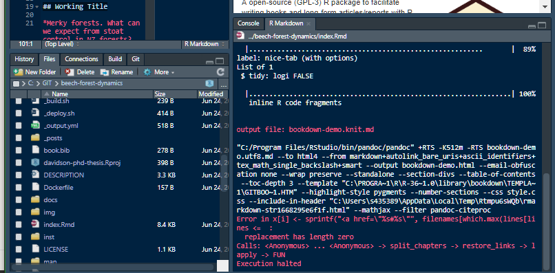
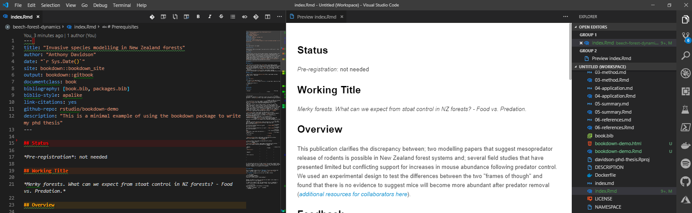
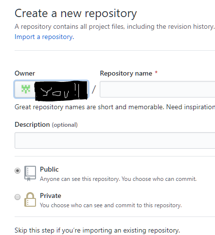
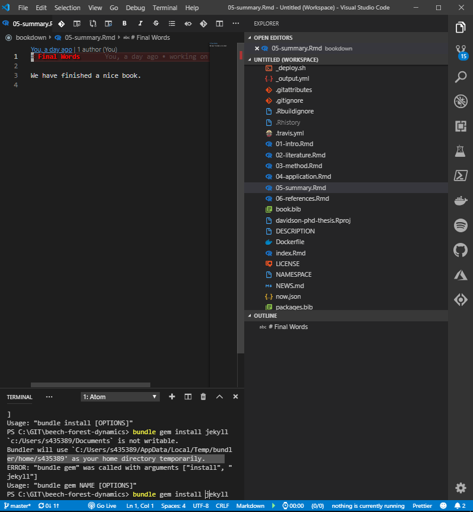
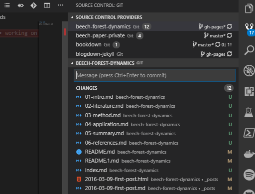

[](https://travis-ci.org/rstudio/bookdown)
[](https://cran.r-project.org/package=bookdown)

<a href="https://bookdown.org/yihui/bookdown"></a>

A open-source (GPL-3) R package to facilitate writing books and long-form articles/reports with R Markdown.

## My notes

So once I had everything downloaded and ready to go I realised I wasn’t sure how to deal with rendering different bits’n’bobs of the “book”.

My simple steps:

1. From RStudio from the very start I can’t render `rmd` file from the simple `knit` button I am so used to
2. So I can look at it in `vs-code` quickly
3. So first step is to work out rendering options for `RStudio`;
   1. `servr`
   2. `rmarkdown`
   3. `bookdown`
   4. `render`
   5. many many more....

### Extra note

If you have just cloned the `bookdown` template then you will need to create a new repository on `github` with the following commands:

“I still haven’t got this sorted yet”

```shell
# Sets the new remote
$ git remote add origin remote 
repository URL

# Verifies the new remote URL
$ git remote -v

# Pushes the changes in your local repository up to the remote repository you specified as the origin
$ git push origin master

```

### A “maybe” simpler way

A manual way to do this is to create the repository online and add `bookdown` manually then pull it down to your local computer like so:

1. Create new public repository 

2. Copy files from `bookdown` repository (locally or from web)

3. Clone new repository locally `git clone`

4. ``git` commit your life away

   

   

For my PhD I will need this to be compiled and build like this so I have set up the framework for this and the layout here in my repository:

And my first draft publication is also now in this format with all relevant information here

www.ssnhub.com/beech-forest-dynamics/

### Resources

I have written a series of blogs around this topic and will continue to build these resources as I come up against challenges in building and publishing my PhD in this format.

 [{{ post.title }}](https://github.com/davan690/beech-forest-dynamics/blob/master/{{ post.url }}) ({{ post.date | date_to_string }})
{{ post.description }} 